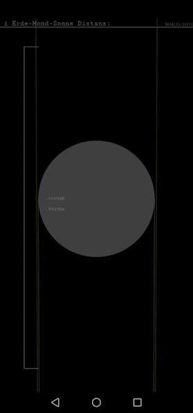
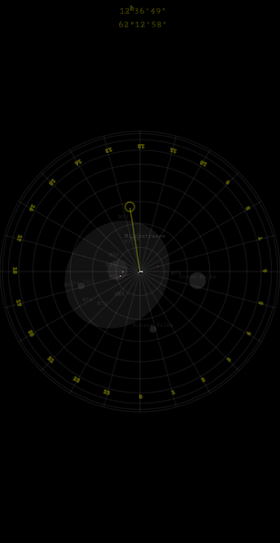

# SSR
Solar System Simulation `SSR`. Android globus coelestis (celestial globe) and interactive calendar with zodiac signs and timepiece covering the solar system in the entire observable universe up to $r=14.25Gpc.$ Contains $n=69$ stars, $n=70$ nebulae and star clusters, most important Milky Way objects, $n=48$ galaxies and galaxy clusters as well as the most well-known quasars. Full implementation of all $n=110$ Messier objects (Messier, 1784) and more.

Solar system with Asteroid and Kuiper belts as well as Heliosphere:

Inner solar system with orbits, current rotation position of the earth with time and position representation, as well as projection lines to the neighboring planets:

Surrounding stars and their relative position to earth, artificial horizon facing south:

### References
Messier, C. (1784). *Cataloque des nébuleuses et amas d'étoiles, La Connaissance des temps, ou connaissance des mouvements célestes, pour l'année bissextile 1784*. Paris, Imprimerie royale,‎ 1781, p. 227-267. [www.messier-objects.com](https://www.messier-objects.com)
