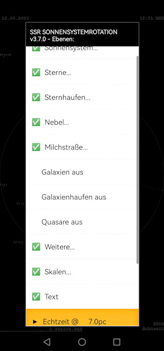
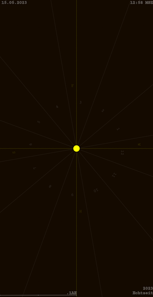
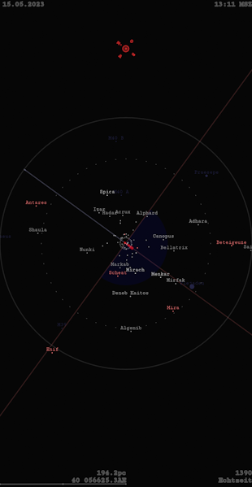
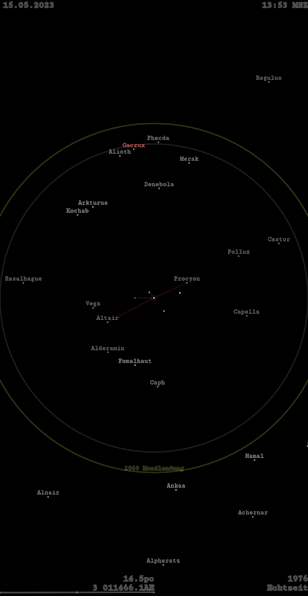

# SSR
Solar System Simulation `SSR`. Android globus coelestis (celestial globe) and interactive calendar with zodiac signs and timepiece covering the solar system in the entire observable universe up to $r=14.25Gpc.$ Contains $n=69$ stars, $n=70$ nebulae and star clusters, most important Milky Way objects, $n=48$ galaxies and galaxy clusters as well as the most well-known quasars. Full implementation of all $n=110$ Messier objects (Messier, 1784) and more:

The sun at $r=0.1au$ astronomical units:

Solar system with Asteroid and Kuiper belts as well as Heliosphere @ $r=58.6au$:

Inner solar system with orbits, current rotation position of the earth with time and position representation, as well as projection lines to the neighboring planets @ $r=1.4au$:

Surrounding stars at $r=194.2pc$ and their relative position to earth, artificial horizon facing south:

The Milky Way @ $r=19kpc$ with magellanic clouds and sagittarius dwarf elliptical galaxy Sag DEG (Ibata et al., 1994):

Closer stars with their relative historical position and representation from $r=14.6pc$ before 1976:

Interactive simulation to display distances between earth, moon and sun with corresponding perspective projection lines:

Interactive simulation to compare sizes of stars:

Hubble deep field (HDF) located at a right ascension of 12h 36m 49s and a declination of +62° 12′ 58″ (see Ferguson, 1996):

Towards the HDF from a distance of $r=151Mpc$ within the surrounding galaxy clusters and superclusters with relative historical positions:

Most distant quasars on the edge of the observable universe at $r>9Gpc$ (see eg. Wang et al., 2021):

Local star cluster containing the signs of the zodiac and surrounding nebulae seen from a distance of $r=3kpc$:

### References
Ferguson, H. (1996). *The Hubble Deep Field – field selection*. Space Telescope Science Institute.

Ibata, R. A., Gilmore, G., & Irwin, M. J. (1994). A dwarf satellite galaxy in Sagittarius. *Nature*. 370, 194-196. [DOI:10.1038%2F370194a0](https://doi.org/10.1038%2F370194a0)

Messier, C. (1784). *Cataloque des nébuleuses et amas d'étoiles, La Connaissance des temps, ou connaissance des mouvements célestes, pour l'année bissextile 1784*. Paris, Imprimerie royale,‎ 1781, p. 227-267. [www.messier-objects.com](https://www.messier-objects.com)

Wang, F., et al. (2021). A Luminous Quasar at Redshift 7.642. *The Astrophysical Journal*. 907(1), L1. [DOI:10.3847%2F2041-8213%2Fabd8c6](https://doi.org/10.3847%2F2041-8213%2Fabd8c6)
